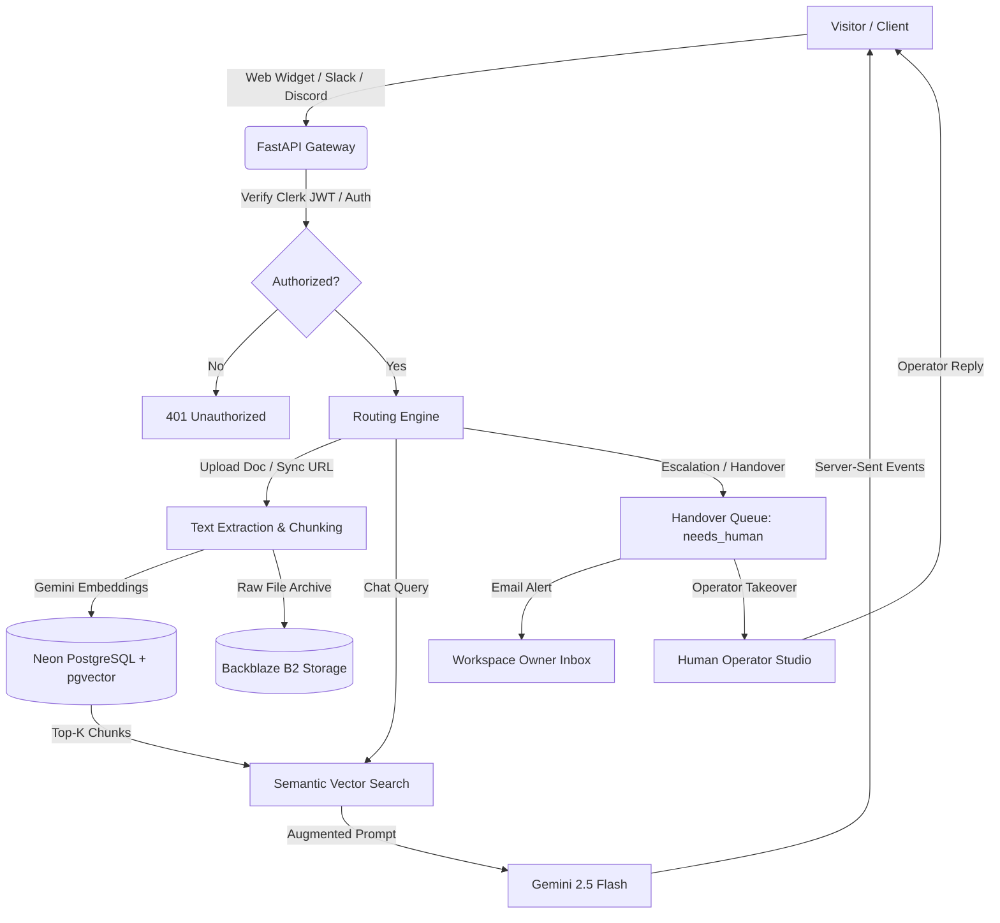

# BaseMind — Autonomous Multi-Channel AI Customer Support & RAG Platform

<div align="center">


[](https://nextjs.org/)
[](https://fastapi.tiangolo.com/)
[](https://neon.tech/)
[](https://ai.google.dev/)
[](https://clerk.com/)
[](LICENSE)

**Deploy high-accuracy, hallucination-resistant AI support agents in minutes.**  
Connect your documents and website URLs, deploy embeddable chat widgets, integrate directly into Slack and Discord, capture inbound leads, and seamlessly escalate complex conversations to human operators in real-time.

[Live Application](https://base-mind.vercel.app) · [Backend API](https://basemind-api.onrender.com/api/health) · [Interactive API Docs](https://basemind-api.onrender.com/docs)

</div>

---

## 🌟 Key Features

### 🧠 Grounded Gemini RAG Architecture
- **Multi-Source Ingestion**: Ingest PDF, TXT, CSV, Markdown, and live website URLs via asynchronous streaming web crawlers.
- **pgvector Semantic Search**: High-dimensional vector embeddings (`gemini-embedding-001`, 768-dim) paired with cosine similarity and contextual re-ranking.
- **Backblaze B2 Object Storage**: Private, encrypted cloud storage for original source files with secure time-limited signed download URLs.
- **Transparent Citations**: Every AI response streams real-time citations linking directly to exact source document chunks.

### 🎧 Human-in-the-Loop Live Takeover & Handover
- **Instant Operator Escalation**: Visitors can click "Talk to Human" or type natural language escalation requests (e.g., *"I want to talk to an agent"*).
- **Zero Hallucination Pause**: Automated bot pauses token generation instantly when a thread enters the handover queue (`needs_human`).
- **Live Operator Mode**: Support agents can claim conversations (`in_takeover`), chat directly with visitors using custom agent names, and return conversations back to AI with one click.
- **Real-Time Polling Engine**: Visitor widget and operator studio stay synchronized without page refreshes.

### 💬 Multi-Channel Bot Integrations
- **Embeddable JavaScript Widget**: One-line `<script>` tag or iframe embed (`/widget/{agentId}`) for any web application or CMS.
- **Slack App Webhooks**: Bidirectional Slack bot listening to `app_mention` and DM events, answering queries directly inside customer channels.
- **Discord Bot Webhooks**: Discord interaction endpoint responding to slash commands and server messages.

### 🎯 Lead Capture & CRM Pipeline
- **Pre-Chat & In-Chat Forms**: Capture visitor name, email, phone number, company, and message before or during support conversations.
- **Leads Management**: Dedicated CRM dashboard with status tracking (`new`, `contacted`, `converted`, `dismissed`) and CSV export.
- **Instant Email Alerts**: Asynchronous email notifications to workspace owners via Resend/SMTP when escalations occur or new leads arrive (with rate-limiting cooldowns).

### 🏷️ White-Label Pro Branding
- Custom widget brand name and toggle to remove *"Powered by BaseMind"* branding on Pro accounts.

### 🔐 Multi-Tenant Security & Isolation
- JWT session authentication powered by Clerk with clock-skew tolerance (`leeway=60`) and JWKS auto-discovery.
- Row-Level Ownership Enforcement (`user_id` scoping across all DB queries).
- Ephemeral workspace wipe (`DELETE /api/me`) with cascading purges for GDPR/privacy compliance.

---

## 🏗️ Architecture & Request Flow



---

## 📂 Repository Structure

```
BaseMind/
├── backend/                  # FastAPI REST & SSE API
│   ├── alembic/              # PostgreSQL schema migrations (0001 - 0011)
│   ├── app/
│   │   ├── main.py           # Application entrypoint, CORS, Sentry & Prometheus
│   │   ├── auth.py           # Clerk JWKS & JWT verification with leeway
│   │   ├── models.py         # SQLAlchemy models (User, Agent, Document, Lead, etc.)
│   │   ├── schemas.py        # Pydantic schemas & response validation
│   │   ├── ai.py             # Gemini RAG pipeline, embeddings & streaming
│   │   ├── storage.py        # Backblaze B2 S3-compatible client
│   │   ├── email.py          # Transactional email alert engine
│   │   └── routers/          # Modular API endpoints
│   │       ├── agents.py     # Agent studio & branding configuration
│   │       ├── analytics.py  # Usage metrics, CSAT & sentiment trends
│   │       ├── billing.py    # Subscriptions & checkout
│   │       ├── conversations.py # Chat sessions, SSE & operator takeover
│   │       ├── dashboard.py  # Aggregated workspace statistics
│   │       ├── documents.py  # File upload, web sync & previews
│   │       ├── integrations.py # Slack & Discord webhooks
│   │       ├── leads.py      # Lead capture CRM & CSV exports
│   │       ├── public.py     # Widget public endpoints & handover
│   │       └── admin.py      # Ops observability & tenant management
│   └── tests/                # Pytest functional and integration test suites
│
├── frontend/                 # Next.js 16 App Router (TypeScript, Tailwind CSS)
│   ├── src/
│   │   ├── app/
│   │   │   ├── (app)/        # Protected workspace routes
│   │   │   │   ├── dashboard/    # Workspace overview & onboarding
│   │   │   │   ├── agents/       # Agent configuration & widget customization
│   │   │   │   ├── knowledge-base/# File upload & web crawler ingestion
│   │   │   │   ├── chat/         # Live chat studio & operator takeover
│   │   │   │   ├── leads/        # Lead management CRM
│   │   │   │   ├── analytics/    # Resolution rate & sentiment charts
│   │   │   │   └── settings/     # Storage status & workspace security
│   │   │   ├── widget/       # Standalone embeddable public chat widget
│   │   │   ├── features/     # Product capabilities showcase
│   │   │   ├── pricing/      # Subscription tiers & FAQ
│   │   │   ├── legal/        # Privacy policy & Terms of service
│   │   │   └── page.tsx      # High-conversion marketing landing page
│   │   ├── components/       # UI design system & shared components
│   │   │   ├── footer.tsx    # Responsive SaaS footer with live health status
│   │   │   └── ...
│   │   └── lib/api/          # Strongly-typed API client & Zod schemas
│
└── docs/                     # Technical specifications & system architecture
    ├── API.md                # Comprehensive API endpoint reference
    ├── ARCHITECTURE.md       # Multi-tenant and component architecture
    ├── DB_SCHEMA.md          # Complete PostgreSQL schema & relationships
    ├── DEPLOYMENT.md         # Production deployment guide (Render + Vercel)
    └── TECH_STACK.md         # Complete technology inventory
```

---

## 🚀 Quick Start (Local Development)

### Prerequisites
- Python 3.11+
- Node.js 20+
- PostgreSQL database with `pgvector` extension enabled (or [Neon](https://neon.tech))
- Google Gemini API Key ([Google AI Studio](https://aistudio.google.com/))
- Clerk Authentication project ([Clerk Dashboard](https://clerk.com/))

### 1. Backend Setup

```bash
cd backend

# Create and activate virtual environment
python -m venv .venv
.venv\Scripts\activate       # Windows
# source .venv/bin/activate  # macOS/Linux

# Install dependencies
pip install -r requirements.txt

# Configure environment variables
cp .env.example .env
# Edit .env with your DATABASE_URL, GEMINI_API_KEY, CLERK_JWKS_URL, etc.

# Run database migrations
alembic upgrade head

# Start development server
uvicorn app.main:app --reload --port 8000
```
API will be live at `http://localhost:8000` with Swagger docs at `http://localhost:8000/docs`.

### 2. Frontend Setup

```bash
cd frontend

# Install dependencies
npm install

# Configure environment variables
cp .env.example .env.local
# Set NEXT_PUBLIC_CLERK_PUBLISHABLE_KEY and NEXT_PUBLIC_API_URL=http://localhost:8000

# Start Next.js development server
npm run dev
```
Open `http://localhost:3000` in your browser.

---

## 📡 API Reference Overview

| Domain | Method & Route | Description |
|---|---|---|
| **Health** | `GET /api/health` | Live service health & DB/B2 connectivity |
| **Agents** | `GET /api/agents` · `POST /api/agents` | Manage AI agents and custom instructions |
| **Branding** | `PATCH /api/agents/{id}` | Configure white-label branding & custom names |
| **Documents**| `POST /api/documents/upload` | Ingest PDF, TXT, CSV, MD with Gemini RAG |
| **Crawler**  | `POST /api/documents/sync` | Scrape and embed web pages into knowledge base |
| **Download** | `GET /api/documents/{id}/download-url` | Generate Backblaze B2 short-lived signed URL |
| **Chat**     | `POST /api/conversations/{id}/chat` | SSE streaming AI chat with cited sources |
| **Takeover** | `POST /api/conversations/{id}/takeover` | Human operator claims conversation |
| **Handover** | `POST /api/conversations/{id}/return-to-ai` | Return thread from human operator back to bot |
| **Public**   | `GET /api/public/agents/{id}` | Fetch public widget configuration & branding |
| **Public Chat** | `POST /api/public/conversations/{id}/chat` | Public visitor streaming chat & escalation |
| **Leads**    | `GET /api/leads` · `POST /api/leads/export` | Query captured leads and export to CSV |
| **Slack**    | `POST /api/integrations/slack/events` | Bidirectional Slack event webhook receiver |
| **Discord**  | `POST /api/integrations/discord/interactions` | Discord interaction webhook receiver |

*For complete endpoint schemas, query parameters, and example responses, see [docs/API.md](docs/API.md).*

---

## 🛡️ Production Deployment

BaseMind is optimized for continuous delivery:
- **Frontend**: Deployed on [Vercel](https://vercel.com) with Edge middleware and automated branch previews.
- **Backend**: Deployed on [Render](https://render.com) with automated health probes and Prometheus metrics.
- **Database**: Serverless PostgreSQL with `pgvector` hosted on [Neon](https://neon.tech).
- **Storage**: S3-compatible private storage hosted on [Backblaze B2](https://www.backblaze.com/b2/).

For production environment variables and CI/CD checklists, see [docs/DEPLOYMENT.md](docs/DEPLOYMENT.md).

---

## 📄 License

This project is licensed under the MIT License — see the [LICENSE](LICENSE) file for details.
