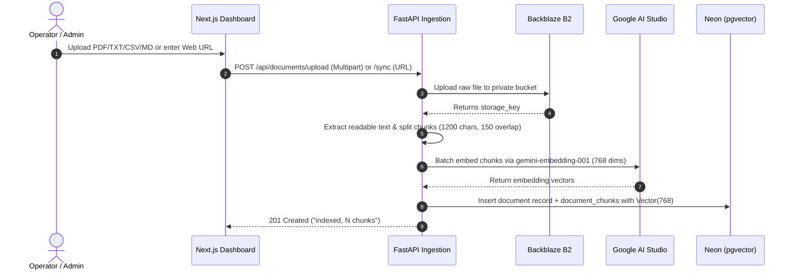
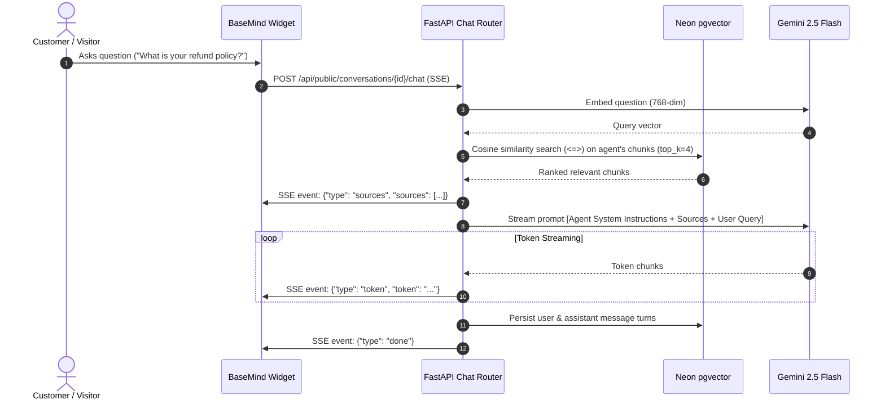
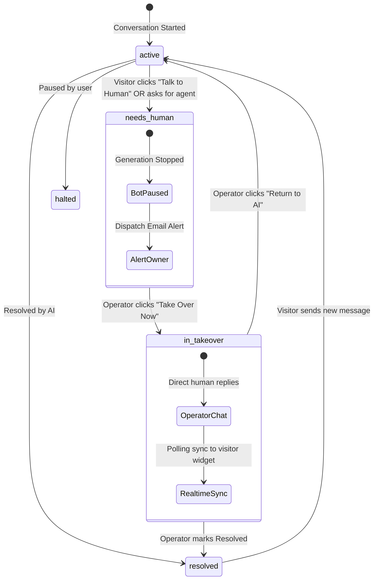

# BaseMind System Architecture

BaseMind is designed as an enterprise-grade, multi-tenant AI Customer Support platform. It combines retrieval-augmented generation (RAG), live human operator takeover, multi-channel messaging bots, and automated lead capture into a unified architecture.

---

## High-Level Topology

```
                  ┌────────────────────────────────────────────────────────┐
                  │                        Clients                         │
                  │  ┌──────────────┐  ┌──────────────┐  ┌──────────────┐  │
                  │  │ Web Browser  │  │ Slack App    │  │ Discord Bot  │  │
                  │  │ (Next.js 16) │  │ (Events API) │  │ (Interactions│  │
                  │  └──────┬───────┘  └──────┬───────┘  └──────┬───────┘  │
                  └─────────┼─────────────────┼─────────────────┼──────────┘
                            │                 │                 │
                            ▼                 ▼                 ▼
  ┌────────────────────────────────────────────────────────────────────────┐
  │                   FastAPI Gateway (Render Production)                  │
  │                                                                        │
  │  ┌────────────────┐   ┌─────────────────┐   ┌───────────────────────┐  │
  │  │  auth.py       │   │  routers/       │   │  ai.py                │  │
  │  │  Clerk JWKS    │   │  • agents       │   │  • Gemini Embeddings  │  │
  │  │  Leeway skew   │   │  • documents    │   │  • pgvector Cosine Sim│  │
  │  │  User Upsert   │   │  • conversations│   │  • 2.5-Flash Streaming│  │
  │  └────────────────┘   │  • public widget│   └───────────────────────┘  │
  │                       │  • integrations │                              │
  │  ┌────────────────┐   │  • leads        │   ┌───────────────────────┐  │
  │  │  email.py      │   │  • admin / ops  │   │  storage.py           │  │
  │  │  Async Alerts  │   └─────────────────┘   │  • Backblaze B2 S3    │  │
  │  │  Rate Cooldown │                         │  • Signed Download URL│  │
  │  └────────────────┘                         └───────────────────────┘  │
  └───────────────────────────────┬────────────────────────────────────────┘
                                  │
          ┌───────────────────────┼───────────────────────┐
          ▼                       ▼                       ▼
┌───────────────────┐   ┌───────────────────┐   ┌───────────────────┐
│  Neon PostgreSQL  │   │   Backblaze B2    │   │  Google Gemini    │
│  • pgvector (768) │   │  • Encrypted S3   │   │  • text-embedding │
│  • Tenant scoped  │   │  • Original docs  │   │  • gemini-2.5-flash│
└───────────────────┘   └───────────────────┘   └───────────────────┘
```

---

## 1. Document Ingestion & RAG Pipeline



### Knowledge Base Ingestion Details:
- **Chunking Strategy**: 1,200 characters per chunk with a 150-character sliding window overlap to prevent context fragmentation across sentences.
- **Vector Dimension**: 768-dimensional float vectors indexed using PostgreSQL `vector` extension.
- **Fail-safe Storage**: If Backblaze B2 is temporarily unreachable or disabled, vector indexing still succeeds, while file storage gracefully logs a warning.

---

## 2. Real-Time Chat & Retrieval Flow



---

## 3. Human-in-the-Loop Takeover & Handover Queue

BaseMind guarantees that automated AI responses never interfere once a human operator intervenes.



### Handover Enforcement:
1. **Queue Isolation**: In `needs_human` or `in_takeover` states, the public chat endpoint bypasses Gemini RAG entirely. Visitor messages are appended to the database and returned without incurring AI token latency or costs.
2. **Real-Time Polling**: The visitor widget polls `GET /api/public/conversations/{id}` every 3 seconds while in handover, instantly reflecting human operator responses.
3. **Operator Mode**: Operator messages carry `role="operator"` and the operator's display name, rendering distinctive badges in both the studio and visitor widget.

---

## 4. Multi-Channel Messaging Bots (Slack & Discord)

### Slack Events Architecture:
- Incoming HTTP `POST` to `/api/integrations/slack/events`.
- Validates `X-Slack-Signature` using workspace `signing_secret` and HMAC-SHA256.
- Handles `url_verification` challenges automatically.
- Subscribes to `app_mention` and direct messages.
- Invokes Gemini RAG with the agent's knowledge base and replies directly to the Slack message thread.

### Discord Interactions Architecture:
- Incoming HTTP `POST` to `/api/integrations/discord/interactions`.
- Validates cryptographic Ed25519 signatures (`X-Signature-Ed25519`, `X-Signature-Timestamp`).
- Responds to Discord `PING` (Type 1) challenges with `PONG`.
- Executes slash commands and chat questions with citations.

---

## 5. Security & Multi-Tenant Isolation

1. **Authentication (Clerk)**:
   - Client acquires session JWT from Clerk.
   - Backend decodes and verifies JWT against Clerk's JWKS endpoint.
   - Includes a 60-second clock skew tolerance (`leeway=60`) to absorb timestamp drifts between Vercel, Clerk, and Render.
   - Normalizes issuer URL with and without trailing slashes.
2. **Row-Level Tenant Isolation**:
   - Every database query for private resources filters by `user_id == current_user.id`.
   - Foreign keys enforce `ON DELETE CASCADE` so deleting a workspace (`DELETE /api/me`) completely erases all tenant data and files.
3. **White-Label & Domain Sandboxing**:
   - Agents can define `allowed_domains` to restrict iframe embedding and widget initialization.
