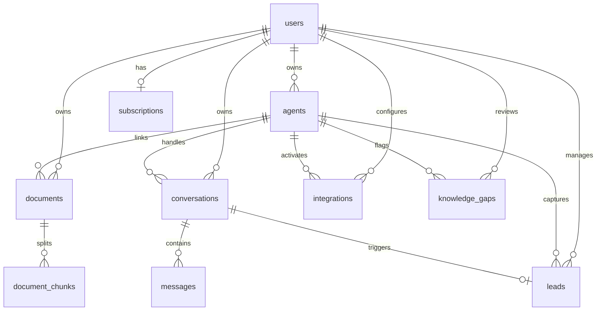

# Database Schema (Neon PostgreSQL + pgvector)

BaseMind uses **PostgreSQL 16** hosted on Neon, with the **pgvector** extension enabled for embedding search and indexing.

```sql
CREATE EXTENSION IF NOT EXISTS vector;
```

---

## Entity Relationship Diagram



---

## Table Definitions

### 1. `users`
Represents registered workspace tenant accounts authenticated via Clerk.

| Column | Type | Constraints | Description |
|---|---|---|---|
| `id` | `TEXT` | PK, UUID | Internal user ID |
| `clerk_id` | `TEXT` | UNIQUE, NOT NULL, INDEX | Clerk user ID (`user_...`) from JWT `sub` claim |
| `email` | `TEXT` | NULLABLE | Primary email address |
| `name` | `TEXT` | NULLABLE | Full display name |
| `platform_status` | `TEXT` | DEFAULT `'active'` | Platform moderation status |
| `created_at` | `TIMESTAMPTZ` | DEFAULT NOW() | Account registration timestamp |

---

### 2. `agents`
Configurable AI customer support agents.

| Column | Type | Constraints | Description |
|---|---|---|---|
| `id` | `TEXT` | PK, UUID | Agent ID |
| `user_id` | `TEXT` | FK → `users.id` (CASCADE), INDEX | Workspace owner |
| `name` | `TEXT` | NOT NULL | Agent name displayed in widget & studio |
| `url` | `TEXT` | DEFAULT `''` | Target company website |
| `instructions` | `TEXT` | DEFAULT `''` | Custom system prompt instructions for Gemini |
| `color` | `TEXT` | DEFAULT `'#0d9488'` | Hex brand accent color |
| `status` | `TEXT` | DEFAULT `'paused'` | `active`, `paused`, or `training` |
| `train_progress` | `INTEGER` | NULLABLE | Training progress percentage |
| `queries_24h` | `INTEGER` | DEFAULT 0 | Rolling 24-hour query count |
| `avg_latency_ms` | `INTEGER` | DEFAULT 0 | Average RAG response latency in ms |
| `greeting_message` | `TEXT` | DEFAULT `'Hi! How can I help you today?'` | Initial greeting shown in widget |
| `suggested_questions` | `TEXT` | DEFAULT `'[]'` | JSON string array of starter question chips |
| `allowed_domains` | `TEXT` | DEFAULT `''` | Comma-separated domain allowlist for widget embeds |
| `lead_capture_enabled`| `BOOLEAN` | DEFAULT `false` | Enables pre-chat lead capture form |
| `lead_capture_title`  | `TEXT` | DEFAULT `'Get in touch'` | Lead form header title |
| `hide_branding`       | `BOOLEAN` | DEFAULT `false` | White-Label Pro toggle to hide BaseMind branding |
| `custom_brand_name`   | `TEXT` | DEFAULT `''` | Custom brand text (e.g. "Powered by Acme AI") |
| `created_at` | `TIMESTAMPTZ` | DEFAULT NOW() | Creation timestamp |
| `updated_at` | `TIMESTAMPTZ` | DEFAULT NOW() | Last update timestamp |

---

### 3. `documents`
Uploaded files or scraped web pages ingested into knowledge bases.

| Column | Type | Constraints | Description |
|---|---|---|---|
| `id` | `TEXT` | PK, UUID | Document ID |
| `user_id` | `TEXT` | FK → `users.id` (CASCADE), INDEX | Owner |
| `agent_id` | `TEXT` | FK → `agents.id` (SET NULL), NULLABLE | Optional link to specific agent |
| `name` | `TEXT` | NOT NULL | File name or web page title |
| `type` | `TEXT` | DEFAULT `'PDF'` | `PDF`, `TXT`, `CSV`, `MD`, or `Web Link` |
| `detail` | `TEXT` | DEFAULT `''` | Human-readable chunk summary |
| `status` | `TEXT` | DEFAULT `'processing'` | `ready`, `processing`, or `failed` |
| `storage_key` | `TEXT` | NULLABLE | Backblaze B2 object key or source URL |
| `created_at` | `TIMESTAMPTZ` | DEFAULT NOW() | Ingestion timestamp |

---

### 4. `document_chunks`
Text partitions embedded with vector representations for similarity search.

| Column | Type | Constraints | Description |
|---|---|---|---|
| `id` | `TEXT` | PK, UUID | Chunk ID |
| `document_id` | `TEXT` | FK → `documents.id` (CASCADE), INDEX | Parent document |
| `user_id` | `TEXT` | FK → `users.id` (CASCADE), INDEX | Multi-tenant isolation |
| `agent_id` | `TEXT` | FK → `agents.id` (CASCADE), NULLABLE | Agent scoping |
| `content` | `TEXT` | NOT NULL | Raw text content of chunk |
| `chunk_index` | `INTEGER` | DEFAULT 0 | Sequential order within document |
| `embedding` | `Vector(768)` | `EMBEDDING_DIM = 768` | Gemini 768-dimensional embedding vector |

---

### 5. `conversations`
Support chat sessions initiated via widget, chat studio, or integrations.

| Column | Type | Constraints | Description |
|---|---|---|---|
| `id` | `TEXT` | PK, UUID | Conversation ID |
| `user_id` | `TEXT` | FK → `users.id` (CASCADE), INDEX | Workspace owner |
| `agent_id` | `TEXT` | FK → `agents.id` (SET NULL), NULLABLE | Associated agent |
| `visitor` | `TEXT` | DEFAULT `'Guest'` | Visitor name or tester handle |
| `status` | `TEXT` | DEFAULT `'active'` | `active`, `resolved`, `halted`, `needs_human`, `in_takeover` |
| `preview` | `TEXT` | DEFAULT `''` | Snippet of last message |
| `duration_seconds` | `INTEGER` | DEFAULT 0 | Total conversation duration |
| `sentiment` | `TEXT` | DEFAULT `'neutral'` | `positive`, `neutral`, or `negative` |
| `csat_score` | `INTEGER` | NULLABLE | Visitor rating (1-5) |
| `handover_requested_at` | `TIMESTAMPTZ` | NULLABLE, INDEX | Timestamp when visitor requested human escalation |
| `assigned_to` | `TEXT` | NULLABLE | Name or email of operator claiming takeover |
| `started_at` | `TIMESTAMPTZ` | DEFAULT NOW() | Session start timestamp |

---

### 6. `messages`
Individual turns within conversations.

| Column | Type | Constraints | Description |
|---|---|---|---|
| `id` | `TEXT` | PK, UUID | Message ID |
| `conversation_id` | `TEXT` | FK → `conversations.id` (CASCADE), INDEX | Thread ID |
| `role` | `TEXT` | NOT NULL | `user`, `assistant`, `agent`, or `operator` |
| `content` | `TEXT` | NOT NULL | Message text body |
| `sources` | `TEXT` | NULLABLE | JSON array of retrieved chunk citations |
| `rating` | `INTEGER` | NULLABLE | Thumbs up (1) / Thumbs down (-1) |
| `feedback_reason` | `TEXT` | NULLABLE | Optional reason for negative feedback |
| `sender_name` | `TEXT` | NULLABLE | Display name of human operator when `role='operator'` |
| `created_at` | `TIMESTAMPTZ` | DEFAULT NOW() | Message timestamp |

---

### 7. `leads`
Prospective customer inquiries captured via public widgets.

| Column | Type | Constraints | Description |
|---|---|---|---|
| `id` | `TEXT` | PK, UUID | Lead ID |
| `user_id` | `TEXT` | FK → `users.id` (CASCADE), INDEX | Workspace owner |
| `agent_id` | `TEXT` | FK → `agents.id` (SET NULL), NULLABLE, INDEX | Source agent |
| `conversation_id` | `TEXT` | FK → `conversations.id` (SET NULL), NULLABLE, INDEX | Associated chat session |
| `name` | `TEXT` | NULLABLE | Lead full name |
| `email` | `TEXT` | NOT NULL | Lead email address |
| `phone` | `TEXT` | NULLABLE | Phone number |
| `company` | `TEXT` | NULLABLE | Company / Organization |
| `message` | `TEXT` | NULLABLE | Inbound note or inquiry |
| `status` | `TEXT` | DEFAULT `'new'` | `new`, `contacted`, `converted`, `dismissed` |
| `created_at` | `TIMESTAMPTZ` | DEFAULT NOW(), INDEX | Timestamp captured |

---

### 8. `integrations`
Multi-channel bot webhook configurations.

| Column | Type | Constraints | Description |
|---|---|---|---|
| `id` | `TEXT` | PK, UUID | Integration ID |
| `user_id` | `TEXT` | FK → `users.id` (CASCADE), INDEX | Workspace owner |
| `agent_id` | `TEXT` | FK → `agents.id` (CASCADE), INDEX | Connected agent |
| `platform` | `TEXT` | NOT NULL | `slack` or `discord` |
| `bot_token` | `TEXT` | NULLABLE | OAuth bot token |
| `signing_secret` | `TEXT` | NULLABLE | HMAC signing secret for webhook verification |
| `webhook_url` | `TEXT` | NULLABLE | Outbound webhook URL |
| `channel_id` | `TEXT` | NULLABLE | Connected channel ID |
| `status` | `TEXT` | DEFAULT `'active'` | `active` or `inactive` |
| `created_at` | `TIMESTAMPTZ` | DEFAULT NOW() | Creation timestamp |
| `updated_at` | `TIMESTAMPTZ` | DEFAULT NOW() | Update timestamp |

---

### 9. `knowledge_gaps`
Unanswered or low-confidence queries automatically flagged for admin review.

| Column | Type | Constraints | Description |
|---|---|---|---|
| `id` | `TEXT` | PK, UUID | Gap ID |
| `user_id` | `TEXT` | FK → `users.id` (CASCADE), INDEX | Workspace owner |
| `agent_id` | `TEXT` | FK → `agents.id` (SET NULL), NULLABLE, INDEX | Agent ID |
| `conversation_id` | `TEXT` | FK → `conversations.id` (SET NULL), NULLABLE | Chat thread |
| `query` | `TEXT` | NOT NULL | Customer query that had no context |
| `matched_context` | `TEXT` | NULLABLE | Partial context retrieved (if any) |
| `ai_response_snippet` | `TEXT` | NULLABLE | What the AI responded |
| `reason` | `TEXT` | DEFAULT `'low_confidence'` | Failure classification |
| `frequency` | `INTEGER` | DEFAULT 1 | Count of similar queries |
| `status` | `TEXT` | DEFAULT `'unresolved'`, INDEX | `unresolved`, `resolved`, `ignored` |
| `resolution_note` | `TEXT` | NULLABLE | Note by admin when resolving |
| `created_at` | `TIMESTAMPTZ` | DEFAULT NOW() | Initial detection timestamp |
| `last_asked_at` | `TIMESTAMPTZ` | DEFAULT NOW(), INDEX | Most recent occurrence |

---

### 10. `subscriptions`
Billing and subscription status.

| Column | Type | Constraints | Description |
|---|---|---|---|
| `id` | `TEXT` | PK, UUID | Subscription record ID |
| `user_id` | `TEXT` | FK → `users.id` (CASCADE), UNIQUE | Subscribed user |
| `plan` | `TEXT` | DEFAULT `'free'` | `free`, `starter`, `pro`, `enterprise` |
| `status` | `TEXT` | DEFAULT `'active'` | `active`, `canceled`, `past_due` |
| `stripe_customer_id` | `TEXT` | NULLABLE | Stripe customer ID |
| `razorpay_subscription_id` | `TEXT` | NULLABLE, INDEX | Razorpay subscription ID |
| `razorpay_customer_id` | `TEXT` | NULLABLE | Razorpay customer ID |
| `razorpay_plan_id` | `TEXT` | NULLABLE | Razorpay plan ID |
| `current_period_end` | `TIMESTAMPTZ` | NULLABLE | Expiry / renewal date |
| `created_at` | `TIMESTAMPTZ` | DEFAULT NOW() | Record creation |

---

## Alembic Migration History

| Version | Migration Identifier | Description |
|---|---|---|
| `0001` | `0001_initial_schema` | Initial tables (`users`, `agents`, `documents`, `document_chunks`, `conversations`, `messages`) |
| `0002` | `0002_add_pgvector` | Added `pgvector` vector extension and 768-dim embedding column |
| `0003` | `0003_storage_keys` | Added `storage_key` to `documents` for Backblaze B2 |
| `0004` | `0004_event_logs` | Added `event_logs` table for system audit logging |
| `0005` | `0005_announcements` | Added `announcements` and `announcement_reads` |
| `0006` | `0006_leads_crm` | Added `leads` table and agent relationship |
| `0007` | `0007_integrations` | Added `integrations` table for Slack and Discord bots |
| `0008` | `0008_knowledge_gaps` | Added `knowledge_gaps` automated detection table |
| `0009` | `0009_subscriptions` | Added `subscriptions` with Stripe & Razorpay customer mapping |
| `0010` | `0010_live_agent_handover` | Added `handover_requested_at`, `assigned_to`, and `sender_name` |
| `0011` | `0011_agent_whitelabel_branding` | Added `hide_branding` and `custom_brand_name` to `agents` |
